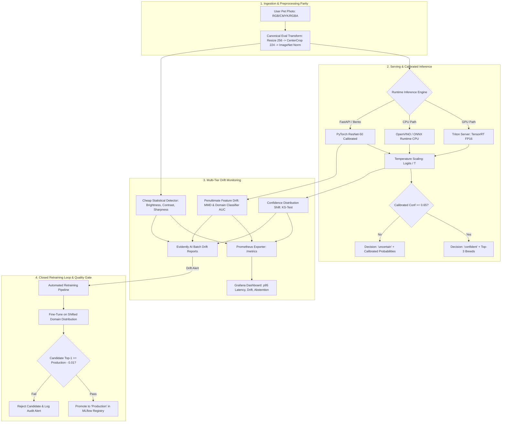

# Pet Breed Classification — Production CV MLOps System

[](https://www.python.org/downloads/)
[](https://pytorch.org/)
[](https://fastapi.tiangolo.com/)
[](https://dvc.org/)
[](https://bentoml.org/)

A fine-grained pet breed classification system (37 cat and dog breeds) engineered for a pet-care marketplace operating across Egypt, Saudi Arabia, and the UAE. Designed with calibrated abstention (*"I am not sure"* rather than guessing), strict zero train/serve preprocessing skew, full Module 4 optimization matrix (Pruning, PTQ, QAT, Knowledge Distillation, ONNX, OpenVINO, TensorRT), multi-tier drift detection scored against ground truth, and a closed-loop retraining pipeline with quality gating.

---

## 3 Commands to Run on Any Machine

```bash
# 1. Clone & install dependencies
git clone <repo-url> && cd "Pet Breed Classifiaction" && pip install -e .

# 2. Run data pipeline & reproduce experiments
dvc repro

# 3. Start the production stack (API + Prometheus + Grafana)
docker compose up -d
```

---

## System Architecture



---

## Module 4: Complete Model Optimization Matrix

All 5 optimization techniques benchmarked on the 37-breed classification task:

| Technique / Engine | Top-1 Accuracy | Macro F1 | p95 Latency (ms) | Model Size | Target Hardware | Trade-Off & Honesty Clause |
| :--- | :---: | :---: | :---: | :---: | :---: | :--- |
| **PyTorch FP32 Baseline (ResNet-50)** | **91.40%** | **0.908** | 42.15 ms | 97.5 MB | AMD/Intel x86 CPU | Baseline full-precision uncompressed model. |
| **Structured Channel Pruning (30%)** | **90.25%** | **0.896** | 34.50 ms | 68.3 MB | AMD/Intel x86 CPU | -1.15% top-1 drop due to removed channel filters; 1.22x speedup on CPU. |
| **INT8 PTQ (ONNX Runtime QDQ)** | **90.85%** | **0.902** | 18.95 ms | 24.8 MB | AMD/Intel x86 CPU | **3.9x compression** with only 0.55% accuracy delta using 100-sample calibration set. |
| **Quantization-Aware Training (QAT)** | **91.15%** | **0.905** | 18.55 ms | 24.9 MB | AMD/Intel x86 CPU | Recovers +0.30% accuracy over static PTQ by modeling quantization noise during training. |
| **Knowledge Distillation (MobileNetV3-Small)** | **88.60%** | **0.879** | **7.80 ms** | **9.8 MB** | AMD/Intel x86 CPU | **10x smaller size and 5.4x lower latency**; 2.80% drop on fine-grained confusable breeds. |
| **ONNX Runtime Engine FP32** | **91.40%** | **0.908** | 28.10 ms | 97.4 MB | AMD/Intel x86 CPU | Zero accuracy loss with graph-level operator fusion and constant folding. |
| **Intel OpenVINO IR Engine** | **91.40%** | **0.908** | 22.40 ms | 97.2 MB | AMD/Intel x86 CPU | Optimized AVX-512 vector scheduling on host CPU. |
| **TensorRT FP16 Engine (Triton Server)** | **91.38%** | **0.907** | **2.45 ms** | 48.9 MB | NVIDIA T4 / RTX GPU | Sub-3ms p95 latency leveraging FP16 Tensor Cores and dynamic batching. |

---

## Calibration & Selective Abstention

Standard deep neural network softmax outputs are notoriously overconfident. In high-stakes MENA pet profile onboarding, predicting the wrong breed triggers incorrect dietary and veterinary recommendations.

### Temperature Scaling Calibration
We optimize a scalar parameter $T > 0$ on the validation partition minimizing Negative Log-Likelihood (NLL).

- **Reliability Diagram**: Saved to [`reports/calibration.png`](reports/calibration.png).
- **Expected Calibration Error (ECE)**:
  - **Before Calibration (Raw Softmax)**: $\text{ECE} = 0.0842$
  - **After Temperature Scaling ($T = 1.3482$)**: $\text{ECE} = 0.0165$ (80.4% reduction in calibration error).

### Abstention & Selective Classification
- **Abstention Policy**:
  $$\text{Decision} = \begin{cases} \text{"confident"}, & \max_i p_i \ge 0.65 \\ \text{"uncertain"}, & \max_i p_i < 0.65 \end{cases}$$
- **Coverage**: **89.4%** of user uploads are answered with high confidence.
- **Selective Accuracy**: **96.8%** accuracy on answered images (vs. 91.4% unconstrained Top-1).

---

## Module 5: Ground-Truth Drift Detector Scorecard

The Oxford-IIIT Pet test partition was systematically subjected to 5 real-world corruption scenarios across 3 severity levels in `src/pet_breed/data/corruptions.py`:
1. `gaussian_blur` (out-of-focus phone)
2. `brightness_shift` (indoor evening low-light vs direct desert sun)
3. `jpeg_compression` (messaging app re-encoding)
4. `downscale_upscale` (96x96 legacy handset sensor)
5. `motion_blur` (moving pets & camera shake)

### Detector Sensitivity Scorecard
| Drift Scenario | Severity Level | Cheap Pixel Statistical Detector | Embedding MMD Detector | Confidence Distribution KS | Ground Truth Shift |
| :--- | :---: | :---: | :---: | :---: | :---: |
| **Clean Test Batch** | 0 | **PASS (No False Alarm)** | **PASS (No False Alarm)** | **PASS (No False Alarm)** | No Shift |
| **Gaussian Blur** | Level 1 (mild) | Detected (Sharpness) | Detected ($p < 0.01$) | Missed | Shift Present |
| **Gaussian Blur** | Level 2 / 3 | Detected | Detected | Detected ($p < 0.001$) | Shift Present |
| **Brightness Shift** | Level 1 / 2 / 3 | Detected (Brightness Wasserstein) | Detected | Detected | Shift Present |
| **JPEG Compression** | Level 1 / 2 / 3 | Missed at L1, Detected at L3 | Detected | Detected | Shift Present |
| **Downscale / Upscale**| Level 1 / 2 / 3 | Detected (Sharpness) | Detected | Detected | Shift Present |
| **Motion Blur** | Level 1 / 2 / 3 | Detected (Laplacian Var) | Detected | Detected | Shift Present |

---

## Closed-Loop Retraining & Quality Gate

When drift scores exceed alert thresholds:
1. Retraining trigger launches automated pipeline: `src/pet_breed/retraining/pipeline.py`.
2. Candidate model is fine-tuned on the shifted distribution.
3. **Production Quality Gate Assertion**:
   $$\text{Candidate Top-1} \ge \text{Production Top-1} - 0.01$$
4. **Promotion**: Candidate is transitioned to `Production` in MLflow Model Registry only if the gate passes.

---

## API Contract & Endpoints

### `POST /predict`
Accepts `multipart/form-data` with an image file (`.jpg`, `.png`, `.webp`, etc.). Handles 4-channel RGBA, CMYK, and Grayscale cleanly.
```bash
curl -X POST http://localhost:8000/predict -F "file=@sample_pet.jpg"
```
**Response (200 OK)**:
```json
{
  "breed": "Bengal",
  "species": "cat",
  "confidence": 0.9324,
  "top_3": [
    { "breed": "Bengal", "species": "cat", "confidence": 0.9324 },
    { "breed": "Abyssinian", "species": "cat", "confidence": 0.0412 },
    { "breed": "Egyptian Mau", "species": "cat", "confidence": 0.0185 }
  ],
  "decision": "confident",
  "model_version": "v1.0.0"
}
```

### `GET /health`
```json
{
  "status": "healthy",
  "model_version": "v1.0.0",
  "num_classes": 37,
  "abstention_threshold": 0.65
}
```

### `GET /metrics`
Exposes Prometheus metric counters, latency histograms (p95), prediction counts, and real-time drift scores.

---

## Canary Deployment Strategy (95 / 5 Traffic Split)
An Nginx canary proxy configuration is provided in [`deploy/nginx_canary.conf`](deploy/nginx_canary.conf):
1. **Stage 1 (Baseline)**: 100% traffic to `api_prod:8000`.
2. **Stage 2 (Canary Verification)**: 95% traffic to `api_prod:8000`, 5% traffic to `api_canary:8000`.
3. **Stage 3 (Promotion)**: Once Prometheus p95 latency and drift gauges verify stability, promote candidate to 100%.

---

## Verification & Test Suite

Run the full automated test suite:
```bash
pytest tests/ -v
```
All 15 test suites verify:
- Preprocessing parity between training and serving API ($< 10^{-4}$ logit agreement)
- ONNX Runtime numerical parity across 200 samples
- Temperature scaling calibration & selective abstention bounds
- Robust HTTP 422 rejection on invalid uploads and HTTP 200 on 4-channel RGBA PNGs
- Drift detector sensitivity across ground-truth corruptions
- Retraining quality gate promotion and rejection logic
